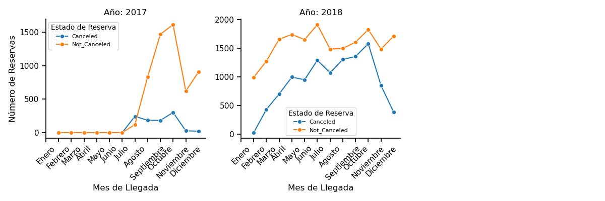
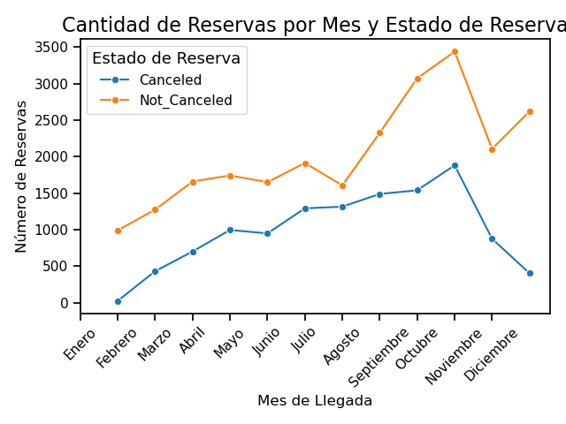
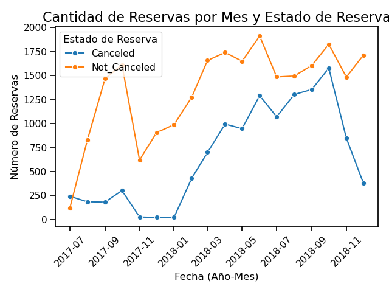
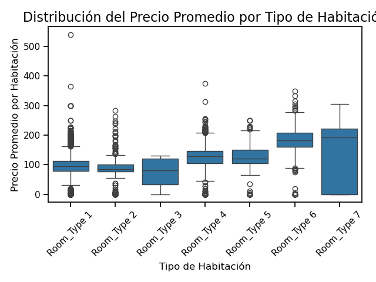
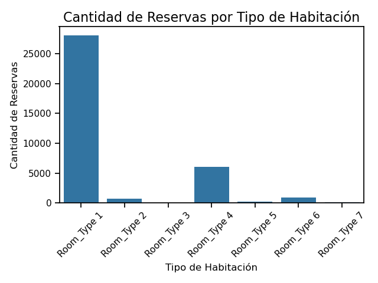
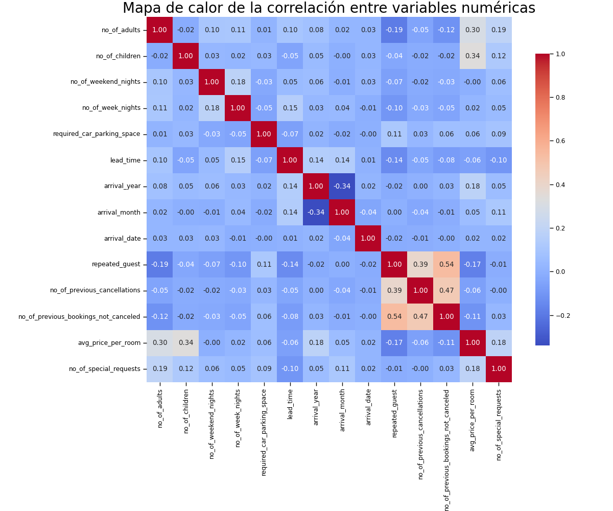

# Dataset 2 Hotel Booking
Este data set está disponible de manera pública en Kaggle:
https://www.kaggle.com/datasets/779de8cc626fb0c43e6083e957a3a045463962637600765c74dd400a268430d3

El dataset posee 19 columnas y 36275 filas.

No hay información sobre el origen de estos datos.

Ha rasgos generales:
- El dataset posee columnas sobre la reserva del hotel
- La columna ``booking_status`` indica si la reserva fue cancelada o no.

### Descripción de las columnas
- ``Booking_ID``: Identificador único de cada reserva.  
- ``no_of_adults``: Número de adultos.  
- ``no_of_children``: Número de niños.  
- ``no_of_weekend_nights``: Número de noches de fin de semana (sábado o domingo) en las que el huésped se hospedó o reservó para hospedarse en el hotel.  
- ``no_of_week_nights``: Número de noches entre semana (lunes a viernes) en las que el huésped se hospedó o reservó para hospedarse en el hotel.  
- ``type_of_meal_plan``: Tipo de plan de comidas reservado por el cliente.  
- ``required_car_parking_space``: Indica si el cliente requiere un espacio de estacionamiento. (0 - No, 1 - Sí).  
- ``room_type_reserved``: Tipo de habitación reservada por el cliente.
- ``lead_time``: Número de días entre la fecha de reserva y la fecha de llegada.  
- ``arrival_year``: Año de la fecha de llegada.  
- ``arrival_month``: Mes de la fecha de llegada.  
- ``arrival_date``: Día del mes de la fecha de llegada.  
- ``market_segment_type``: Designación del segmento de mercado.  
- ``repeated_guest``: Indica si el cliente es un huésped recurrente. (0 - No, 1 - Sí).  
- ``no_of_previous_cancellations``: Número de reservas anteriores que fueron canceladas por el cliente antes de la reserva actual.  
- ``no_of_previous_bookings_not_canceled``: Número de reservas anteriores que no fueron canceladas por el cliente antes de la reserva actual.  
- ``avg_price_per_room``: Precio promedio por día de la reserva; los precios de las habitaciones son dinámicos (en euros).  
- ``no_of_special_requests``: Número total de solicitudes especiales realizadas por el cliente (por ejemplo, piso alto, vista desde la habitación, etc.).  
- ``booking_status``: Indicador que señala si la reserva fue cancelada o no.  

### Campos vacios (Proporción)
Este dataset no presenta campos vacíos
````
Booking_ID                              0
no_of_adults                            0
no_of_children                          0
no_of_weekend_nights                    0
no_of_week_nights                       0
type_of_meal_plan                       0
required_car_parking_space              0
room_type_reserved                      0
lead_time                               0
arrival_year                            0
arrival_month                           0
arrival_date                            0
market_segment_type                     0
repeated_guest                          0
no_of_previous_cancellations            0
no_of_previous_bookings_not_canceled    0
avg_price_per_room                      0
no_of_special_requests                  0
booking_status                          0
````
## Análisis Exploratorio de Datos
**Planes de comida**
````
type_of_meal_plan
Meal Plan 1     27835
Not Selected     5130
Meal Plan 2      3305
Meal Plan 3         5
````
**Tipos de habitaciones**
````
room_type_reserved
Room_Type 1    28130
Room_Type 4     6057
Room_Type 6      966
Room_Type 2      692
Room_Type 5      265
Room_Type 7      158
Room_Type 3        7
````
**Tipo de segmento de mercado**
````
market_segment_type
Online           23214
Offline          10528
Corporate         2017
Complementary      391
Aviation           125
````
**Estado de la reseva**
````
booking_status
Not_Canceled    24390
Canceled        11885
````
### Reserva por meses y años


- El gráfico muestra un aumento gradual en las reservas no canceladas a medida que avanza el año, con un pico significativo hacia diciembre.
Las cancelaciones parecen ser constantes y relativamente bajas en comparación con las reservas no canceladas.
- En 2018, sucede algo similar, pero con un incremento más pronunciado en ambas categorías de reservas desde marzo hasta diciembre.
Hay un aumento notable en las reservas no canceladas en agosto, mientras que las cancelaciones muestran un crecimiento a finales del año.

Datos incompletos:

Las decisiones basadas únicamente en este gráfico podrían ser sesgadas para los meses donde los datos son insuficientes, afectando la planificación operativa, la capacidad de predicción de las tendencias de reserva, y las interpretaciones sobre estacionalidad.

### Reserva por meses



- Las reservas no canceladas (línea naranja) superan significativamente a las canceladas (línea azul) durante todo el año, lo cual es un patrón positivo para la hotelería en términos de ocupación efectiva.
- El pico en las reservas no canceladas se encuentra alrededor de octubre, mientras que las cancelaciones también registran un número significativo en este período. Esto puede indicar una alta demanda que podría estar acompañada por políticas de flexibilidad en cancelaciones.
- Sesgo en las Tendencias: Si faltan datos de ciertos meses de 2017, la representación de las tendencias estacionales podría ser inexacta. Por ejemplo, un pico o una caída en las reservas de un mes podrían no reflejarse adecuadamente, lo que sesga el análisis hacia los patrones observados en los meses completos.
### Evolución de la reserva por meses
Este gráfico muestra la cantidad de reservas canceladas y no canceladas por mes, extendiéndose desde mediados de 2017 hasta finales de 2018. Esta visualización permite observar tendencias a lo largo del tiempo en cuanto al comportamiento de las reservas.



- Estacionalidad y Planeación: El gráfico respalda que existe un patrón estacional en el comportamiento de las reservas, particularmente hacia mediados de 2018, que debe considerarse en la planificación operativa.
- Cancelaciones Fluctuantes: Las fluctuaciones en las cancelaciones son un área crítica para investigar, ya que impactan en la capacidad del hotel de maximizar la ocupación.
- Crecimiento Sostenido: A pesar de las cancelaciones, las reservas no canceladas presentan una tendencia creciente positiva, indicando un potencial crecimiento del mercado si se gestiona adecuadamente.

### Precio promedio por tipo de habitacion
Este gráfico es un diagrama de cajas (boxplot) que representa la distribución del precio promedio por habitación para diferentes tipos de habitaciones. Cada caja visualiza la variabilidad del precio de las habitaciones en función de su tipo, permitiendo comparar las diferencias entre categorías



- Comparación de Medianas:

  - El tipo de habitación 7 tiene la mediana de precio más alta, indicando que generalmente estas habitaciones cuestan más en promedio.
  - El tipo de habitación 6 también tiene precios comparativamente altos, aunque con una mayor dispersión.

- Rango de Precios y Dispersión:

  - Los tipos de habitación 1 y 3 muestran menos variabilidad en los precios con rangos intercuartílicos más estrechos, sugiriendo precios más consistentes.
  - El tipo de habitación 7 presenta tanto una mediana alta como un rango amplio, indicando varianza alta en los precios que podría deberse a diferencias significativas en las características de la habitación o en la disponibilidad.
- Valores atípicos
  - La presencia de numerosos puntos atípicos, especialmente en los tipos 1, 2, y 6, sugiere que hay algunas habitaciones cuyo precio está significativamente por encima del promedio, tal vez debido a características especiales, ubicaciones preferenciales o demanda puntual.
- Estratificación
  - Las diferencias en la mediana y el rango de precios sugieren que los diferentes tipos de habitaciones están probablemente estratificados por características adicionales (lujo, tamaño, comodidades), coordinándose con expectativas de los huéspedes y estrategias de precios del hotel.

### Reserva por tipo de habitaciones
Este gráfico es un histograma que muestra la cantidad de reservas para cada tipo de habitación.



- Demanda Desproporcionada:
La mayoría abrumadora de las reservas se concentra en el Tipo de Habitación 1, indicando que esta categoría es significativamente más popular o más disponible que los otros tipos de habitaciones.
- Reserva muy baja en otros tipos:
Los tipos de habitaciones 2 a 7 tienen un número muy bajo de reservas en comparación con el Tipo de Habitación 1.
Esto podría ser indicativo de varias situaciones, como menor disponibilidad, precios más altos, o características que no satisfacen igualmente la demanda del mercado.
- Diversificación y Estrategia
  - Este patrón puede sugerir al hotel la necesidad de evaluar por qué un solo tipo de habitación es tan demandado, y si hay oportunidades para redistribuir demanda a otros tipos de habitaciones.
  - También plantea la cuestión de si el inventario de habitaciones está alineado con la demanda de los clientes y si se podrían hacer cambios en la estrategia de marketing o en las comodidades ofrecidas para mejorar la ocupación de las habitaciones subutilizadas.

## Procesamiento de Datos
### Verificacion de correlacion
**Mapa de Calor**



**Correlaciones Positivas Fuertes:**

- ``arrival_date`` y ``arrival_year``, arrival_month: Estas variables están altamente correlacionadas (correlación de 1.00 consigo mismas por diseño), lo que indica consistencia en la representación de tiempo.

- ``no_of_weekend_nights`` y ``no_of_week_nights``: Presentan una correlación positiva (0.97), lo que sugiere que las reservas de fin de semana están fuertemente ligadas a las noches de la semana. Esto puede indicar que los huéspedes reservan estancias que comprenden tanto días de semana como fines de semana.

**Correlaciones Negativas:**

- ``lead_time`` y ``repeated_guest``: Muestran una correlación negativa cercana a 0 (-0.02), indicando que el tiempo de anticipación en las reservas no es un factor determinante de si un huésped es recurrente.

- ``arrival_date`` y ``lead_time``: Presentan una correlación negativa ligera, lo cual es lógico ya que un mayor tiempo de anticipación podría significar que la reserva se realiza en una fecha previa lejana al "arrival date".

**Correlaciones Moderadas:**

- ``avg_price_per_room`` con ``no_of_special_requests``: Existe una correlación moderadamente positiva (0.19) entre el precio promedio y el número de solicitudes especiales. Esto podría indicar que estancias más caras están asociadas con más solicitudes personalizadas.

**Falta de Correlaciones Fuertes:**

- La mayoría de las otras correlaciones entre variables no son extremas (cercanas a 1 o -1), lo que sugiere que estas variables actúan en gran medida de manera independiente entre sí, excepto en los casos mencionados.

## Modelos de Machine Learning

### ML Random Forest
Se usaron los mismos parametros que el caso anterior para este modelo

#### Resultados del modelo Random Forest
**Métricas del Reporte de Clasificación**

Precisión Global (Accuracy):

El modelo alcanzó una precisión del 90.54%. Esto indica que el modelo predijo correctamente aproximadamente el 90.5% de los casos en el conjunto de prueba, mostrando un buen nivel de exactitud en la clasificación de las reservas canceladas y no canceladas.
Desempeño por Clase:
### Reporte de Clasificación

| Clase | Métrica         | Valor  | Descripción                                                                 |
|-------|-----------------|--------|-----------------------------------------------------------------------------|
| 0     | Precisión       | 0.89   | El 89% de las reservas predichas como no canceladas fueron efectivamente no canceladas. |
| 0     | Recall (Exhaustividad) | 0.82   | El modelo detectó el 82% de las reservas que realmente no fueron canceladas. |
| 0     | F1-Score        | 0.85   | Buen balance entre precisión y recall, aunque con margen de mejora en la identificación de no cancelaciones. |
| 1     | Precisión       | 0.91   | El 91% de las predicciones de cancelaciones fueron correctas.              |
| 1     | Recall (Exhaustividad) | 0.95   | Excelente capacidad para detectar reservas canceladas.                     |
| 1     | F1-Score        | 0.93   | Fuerte rendimiento equilibrando precisión y recall.                        |

**Promedios Macro y Ponderado**

| Promedio    | Precisión | Recall | F1-Score | 
|-------------|-----------|--------|----------|
| Macro       | 0.90      | 0.88   | 0.89     |
| Ponderado   | 0.90      | 0.91   | 0.90     |


Promedio Macro: Indica una precisión de 0.90, un recall de 0.88 y un F1-Score de 0.89, que son buenos para la mayoría de las métricas, reflejando el desempeño global del modelo sin considerar el balance de clases.

Promedio Ponderado: Similarmente alto, con cifras para precisión y recall cercanas al 0.90, sugiere que el modelo maneja bien posibles desbalances en el conjunto de datos dado que se pondera por el número de instancias en cada clase.

#### Resultados del modelo XG Boost
**Métricas del Reporte de Clasificación**

- Precisión Global (Accuracy):

El modelo alcanzó una precisión del 89%. Esto significa que predijo correctamente el 89% de las observaciones en el conjunto de prueba, lo que demuestra un buen nivel de exactitud.
- Desempeño por Clase:

  Clase 0 (No Canceladas):
  - Precisión: 0.86, indica que el 86% de las reservas predichas como no canceladas fueron correctas.
  - Exhaustividad (Recall): 0.81, sugiere que el modelo detectó el 81% de las reservas que realmente no fueron canceladas.
  - F1-Score: 0.84, muestra un balance razonable entre precisión y recall.

  Clase 1 (Canceladas):
  - Precisión: 0.91, lo que implica una alta precisión para las predicciones correctas de cancelaciones.
  - Exhaustividad (Recall): 0.94, evidencia que el modelo identifica el 94% de las reservas que realmente fueron canceladas.
  - F1-Score: 0.92, refleja un buen equilibrio y rendimiento en la identificación de cancelaciones.
- Promedios Macro y Ponderado:

  - Promedio Macro: Con precisión de 0.89, recall de 0.87 y F1-Score de 0.88, estas cifras indican un desempeño sólido en general, considerando todos los aspectos del modelo por igual.

  - Promedio Ponderado: Similar en precisión y recall, reflejando una gestión adecuada del balance de clases.

## Comparacion de modelos Random Forest y XG Boost
- Precisión Global:

Random Forest muestra una precisión ligeramente mejor (90.54%) que XGBoost (89%), sugiriendo ligeras diferencias en la capacidad global del modelo para clasificar correctamente todas las observaciones.
- Desempeño por Clase (No Canceladas - Clase 0):

Random Forest tiene un mejor F1-Score (0.85) y recall (0.82) que XGBoost (F1-Score de 0.84 y recall de 0.81), indicando que maneja mejor las no cancelaciones.
- Desempeño por Clase (Canceladas - Clase 1):

Los dos modelos son bastante comparables, aunque Random Forest tiene un F1-Score de 0.93 frente al 0.92 de XGBoost. Este leve aumento podría dar ventaja a Random Forest en la identificación de cancelaciones.
- Estabilidad y Generalización:

XGBoost ofrece un desempeño muy estable con buenos precios en recall y precisión, pero Random Forest parece manejar mejor las características específicas del dataset, reflejando superiores resultados en mediciones clave.
